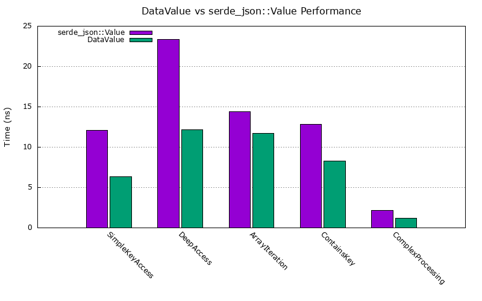

# datavalue-rs

## Introduction
`datavalue-rs` is a Rust library that provides a highly performant, memory-efficient data structure for working with parsed JSON data. It serves as a drop-in replacement for `serde_json::Value`, maintaining API compatibility while optimizing for speed and memory efficiency through arena-based allocation.

The library can be used with any JSON parser by implementing appropriate conversion functions, allowing flexibility in choosing parsing strategies while benefiting from the efficient data representation.

## Motivation
While `serde_json::Value` provides an excellent API, it can face performance challenges in high-throughput scenarios due to frequent heap allocations, pointer chasing, and memory fragmentation. `datavalue-rs` aims to:

- **Maintain API Compatibility**: Serve as a direct drop-in replacement for `serde_json::Value`
- **Improve Performance**: Reduce overhead through arena-based allocation and optimized memory layout
- **Reduce Memory Usage**: Minimize fragmentation and allocations while keeping the same interface

## Performance

`DataValue` significantly outperforms `serde_json::Value` for many common operations, particularly those involving deep access and complex traversals.

For detailed benchmarks and analysis, see [scripts/summary.md](scripts/summary.md).



## Core Functionality

### Value Types
Like `serde_json::Value`, `datavalue-rs` supports all standard JSON data types:
- Null
- Boolean
- Number (Integer and Floating-point)
- String
- Array
- Object (Key-Value pairs)

### Performance Enhancements
While maintaining the same API, `datavalue-rs` uses:
- **Arena Allocation**: Values are allocated in contiguous memory regions, improving cache locality
- **Slices instead of Vectors**: Using slice references to arena-allocated memory reduces indirection
- **Zero-Copy String Handling**: Strings are stored directly in the arena, reducing copies

## Public API

### Core Value Type
```rust
pub enum DataValue<'a> {
    Null,
    Bool(bool),
    Number(Number),
    String(&'a str),
    Array(&'a [DataValue<'a>]),
    Object(&'a [(&'a str, DataValue<'a>)]),
}

pub enum Number {
    Integer(i64),
    Float(f64),
}
```

### Type Checking
```rust
impl<'a> DataValue<'a> {
    pub fn is_null(&self) -> bool;
    pub fn is_bool(&self) -> bool;
    pub fn is_number(&self) -> bool;
    pub fn is_string(&self) -> bool;
    pub fn is_array(&self) -> bool;
    pub fn is_object(&self) -> bool;
}
```

### Value Accessors
```rust
impl<'a> DataValue<'a> {
    pub fn as_bool(&self) -> Option<bool>;
    pub fn as_i64(&self) -> Option<i64>;
    pub fn as_f64(&self) -> Option<f64>;
    pub fn as_str(&self) -> Option<&'a str>;
    pub fn as_array(&self) -> Option<&[DataValue<'a>]>;
    pub fn as_object(&self) -> Option<&[(&'a str, DataValue<'a>)]>;
}
```

### Indexing
```rust
impl<'a> std::ops::Index<&str> for DataValue<'a> {
    type Output = DataValue<'a>;
    fn index(&self, key: &str) -> &Self::Output;
}

impl<'a> std::ops::Index<usize> for DataValue<'a> {
    type Output = DataValue<'a>;
    fn index(&self, index: usize) -> &Self::Output;
}
```

### JSON Pointer
```rust
impl<'a> DataValue<'a> {
    pub fn pointer(&self, pointer: &str) -> Option<&Self>;
}
```

### Serialization
```rust
impl<'a> DataValue<'a> {
    pub fn to_string(&self) -> String;
}

// Module-level functions
pub fn to_string<'a>(value: &DataValue<'a>) -> String;
pub fn to_string_pretty<'a>(value: &DataValue<'a>) -> String;
```

### Deserialization
```rust
impl<'a> DataValue<'a> {
    pub fn from_str(arena: &'a Bump, s: &str) -> Result<Self>;
    pub fn from_slice(arena: &'a Bump, v: &[u8]) -> Result<Self>;
    pub fn from_reader<R: Read>(arena: &'a Bump, reader: R) -> Result<Self>;
}

// Module-level function
pub fn from_str<'a>(arena: &'a Bump, s: &str) -> Result<DataValue<'a>>;
```

### Conversion Traits
```rust
// From implementations for common types
impl<'a> From<bool> for DataValue<'a>;
impl<'a> From<i64> for DataValue<'a>;
impl<'a> From<f64> for DataValue<'a>;
// ... other numeric types ...

// Integration with serde
impl<'a> Serialize for DataValue<'a>;
impl<'de, 'a> Deserialize<'de> for DataValue<'a> where 'de: 'a;
```

## Implementation Notes

### Key Differences from `serde_json::Value`

1. **Arena Parameter**
   - Methods that create or parse values require an arena parameter:
   ```rust
   let arena = Bump::new();
   let value = DataValue::from_str(&arena, r#"{"key": "value"}"#)?;
   ```

2. **Immutability**
   - Due to the arena-based design, DataValue is primarily designed for immutable access
   - Mutating operations require creating new values in the arena

3. **Lifetime Management**
   - Values maintain references to the arena, requiring appropriate lifetime management
   - The DataValue cannot outlive the arena that created it

4. **Parser Integration**
   - Easily integrate with any JSON parser by implementing conversion functions
   - Create custom adapters for specific parsers or data formats while maintaining the efficient arena-based structure

## Examples

### Basic Usage
```rust
use datavalue_rs::{DataValue, Bump};

let arena = Bump::new();

// Parse JSON
let json_str = r#"{"name": "John", "age": 30, "hobbies": ["reading", "coding"]}"#;
let person = DataValue::from_str(&arena, json_str)?;

// Access values
println!("Name: {}", person["name"].as_str().unwrap());
println!("Age: {}", person["age"].as_i64().unwrap());
println!("First hobby: {}", person["hobbies"][0].as_str().unwrap());

// Serialize
let json_string = person.to_string();
```

### Working with Arrays and Objects
```rust
use datavalue_rs::{DataValue, Bump};

let arena = Bump::new();

// Create values
let name = DataValue::new_string(&arena, "Jane");
let age = DataValue::new_number_integer(25);
let hobbies = DataValue::new_array(&arena, vec![
    DataValue::new_string(&arena, "swimming"),
    DataValue::new_string(&arena, "painting"),
]);

// Create object
let person = DataValue::new_object(&arena, vec![
    (arena.alloc_str("name"), name),
    (arena.alloc_str("age"), age),
    (arena.alloc_str("hobbies"), hobbies),
]);

// Serialize to JSON
let json = person.to_string();
println!("{}", json);
```

### Integration with Custom Parsers
```rust
use datavalue_rs::{DataValue, Bump};
use custom_json_parser::Parser;

// Example function to convert from a custom parser's output
fn from_custom_parser<'a>(arena: &'a Bump, parsed_json: &Parser::Value) -> DataValue<'a> {
    match parsed_json {
        Parser::Value::Null => DataValue::Null,
        Parser::Value::Bool(b) => DataValue::Bool(*b),
        Parser::Value::Number(n) => {
            if n.is_integer() {
                DataValue::Number(Number::Integer(n.as_i64().unwrap()))
            } else {
                DataValue::Number(Number::Float(n.as_f64().unwrap()))
            }
        },
        Parser::Value::String(s) => DataValue::String(arena.alloc_str(s)),
        // Handle arrays and objects similarly
        // ...
    }
}

// Using the conversion function
let arena = Bump::new();
let custom_parsed = Parser::parse(json_string);
let data_value = from_custom_parser(&arena, &custom_parsed);
```

## Running Benchmarks

To run the benchmarks and see the performance comparison:

```bash
cargo bench
```

For a detailed analysis and summary:

```bash
./scripts/run_benchmarks.sh
```
