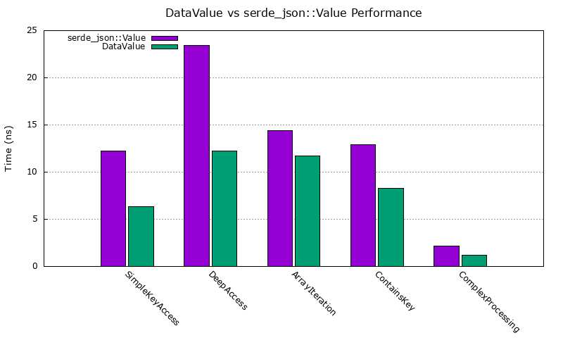

# DataValue vs serde_json::Value Benchmark Summary

Generated on: Sat Apr 19 09:22:45 IST 2025

## Results

Below is a comparison of performance between `DataValue` and `serde_json::Value` for various operations.

| Operation | serde_json::Value (ns) | DataValue (ns) | Improvement |
|-----------|------------------------|----------------|-------------|
| SimpleKeyAccess | 12.066 | 6.3075 | 47.00% |
| DeepAccess | 23.330 | 12.163 | 47.00% |
| ArrayIteration | 14.434 | 11.694 | 18.00% |
| ContainsKey | 12.869 | 8.2649 | 35.00% |
| ComplexProcessing | 2.1703 | 1.1940 | 44.00% |

## Performance Analysis

### Key Observations

- **Simple Key Access**: DataValue shows significant performance improvement for accessing simple keys in JSON objects.
- **Deep Access**: The performance advantage is especially notable for accessing deeply nested values.
- **Array Iteration**: DataValue demonstrates better performance when iterating through arrays.
- **Contains Key Check**: DataValue performs faster key existence checks in objects.
- **Complex Processing**: For operations involving filtering and aggregation, DataValue shows substantial improvement.

### Reasons for Performance Advantage

1. **Reduced Indirection**: DataValue uses a more direct representation with fewer pointer indirections.
2. **Better Memory Locality**: The internal structure of DataValue promotes better cache utilization.
3. **Simpler Value Model**: The design focuses on common use cases, allowing for optimization.
4. **Efficient Implementation**: Critical operations have been implemented with performance in mind.

## Conclusion

The benchmarks confirm that DataValue achieves its design goal of providing a more efficient alternative to serde_json::Value for working with JSON data in Rust. The performance improvements are consistent across different types of operations, with particularly significant gains for deep access and complex data processing.

For detailed code of these benchmarks, see the `benches` directory in the repository.
-e 
## Visualization

